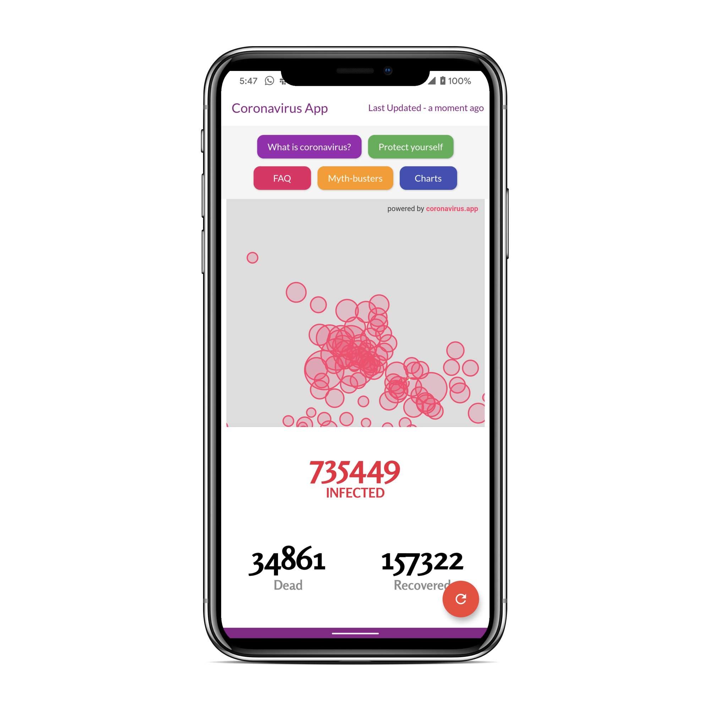
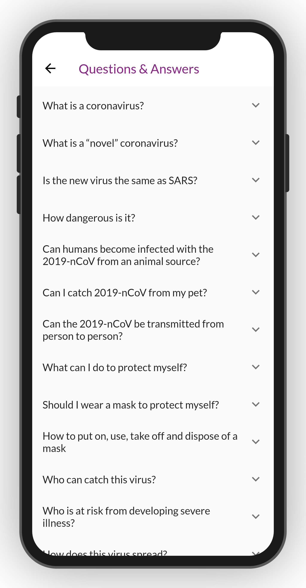
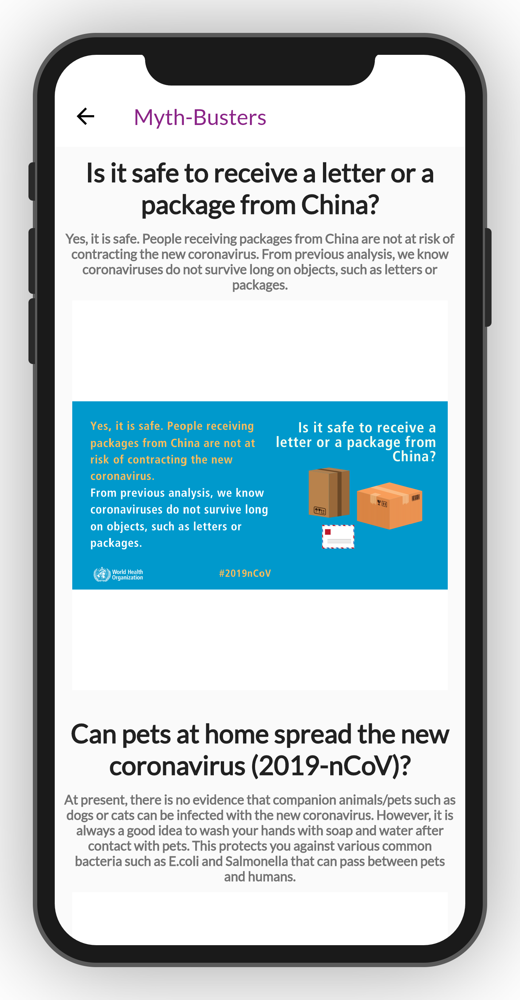
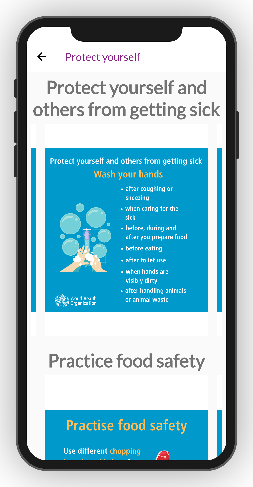

# Coronavirus-Tracker & Help to fight from Coronavirus-Fluttter-App

Coronavirus Warrior App
A Flutter project to track & help to fight from coronavirus
A Flutter app to track Coronavirus outbreak.

What is Coronavirus Warrior?
Coronavirus Warrior is a cross-platform mobile app. It is written in Dart using Flutter.

# Screenshots

 

  
  
  
 

## Building

Android (armeabi-v7a): `flutter build apk`
Android (arm64-v8a): `flutter build apk --target=android-arm64`
iOS: `flutter build ios`

If you have a connected device or emulator you can run and deploy the app with `flutter run`

## Have a question?

If you need any help, feel free to file an issue if you do not manage to find a solution.

## Project Created & Maintained By

### Varun PM
